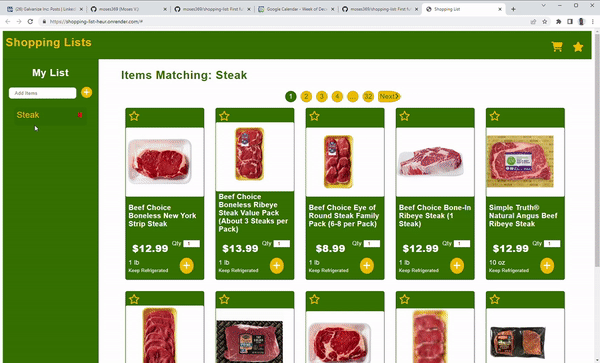
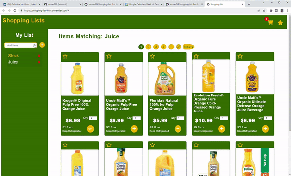

<h1>  MVP Shopping Lists </h1>
<a href='https://shopping-list-heur.onrender.com/#' target='_blank'>Live Site</a>

## Table of Contents
- [About](#about)
- [Project Overview](#project-overview)

## About
 My very first full stack app, I had a very fun time creating this application and deepened my understanding about how the frontend and backend of an application interacts with each other. The goal was to create our very first Minimal Viable Product integrating persistent storage through PostgreSql, while running on an express server following REST standards. As my first full stack app I wanted to create something useful while, keeping it basic. It does not have any checkout functionality as the goal was to create a basic MVP versus a fully functional e-commerce store. I thoroughly enjoyed my time creating this app and can not wait to keep improving and learn further.    

## Project Overview

- [Adding Items](#adding-items)
- [Changing Quanity](#changing-quanity) 
- [Removing Items](#removing-items)

### Adding Items  

> Users are able to add an item to their cart, resulting in the item being crossed off in their list and a notification showing how many items are in their cart displayed
>
> Users can favorite items and it will persist until unfavorited
>
> When users no longer have items with their keyword in their cart, their list item will be un-crossed

### Changing Quanity

> Item quanity can be changed and the price previewed, prior to adding it to a user's cart
>
> After being added to the cart a user can change the quanity anywhere the item and it will accuratley reflect what is in the cart

### Removing Items

> A user can remove items individually in the cart
>
> A user can also remove all cart items associated with the item in their shopping list by deleting it from their shopping list

## Lessons Learned
- Seperating your functions by comments describing their purpose helps maintain awareness of each functions purpose when refactoring and improves overall understanding.
- For some reason when JQuery form events are fired off they send off multiple results based on how many times they have have been cicked, prior. In order to accomodate I had to utilize ` $('element').unbind('event').bind('event',callback function)` in order to only get it to fire off once. Subsequentially on input change events the very first change is not picked up for some reason.
- HTML data-sets are very valuable when interacting with the DOM, and storing information regarding elements to interact with the backend.
- Creating your functionality first and then styling after, may cause issues as elements are no longer in the same hierarchy, however utilizing `element.closest('element')` may possibly resolve any hierachly issues.
- How to properly utilize an OAuth token when making API calls, and utilize my server as a proxy in order to bypass the CORS error.

### Code Stack
- JavaScript
- CSS
- HTML
- Postgres
- NodeJs
- Jquery
- Express
- PostrgeSql
